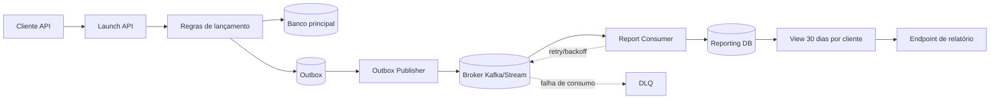

# Questão 2 — Relatório de utilização de lançamentos sem impacto no fluxo crítico

## 1) Análise do problema e regras
O endpoint de lançamento é o produto principal e não pode sofrer impacto de latência, disponibilidade ou erro por causa do novo relatório.  
Logo, a escrita do relatório deve ser **desacoplada, assíncrona e isolada**, com contrato claro: **se o pipeline de relatório falhar, o lançamento continua normalmente**.

Regras principais:
- Janela analítica de 30 dias por cliente.
- Uso de dados já disponíveis na request/resposta do launch.
- Base de dados paralela ao serviço principal.
- Falhas no workflow de relatório não podem afetar o fluxo de launch.

## 2) Solução proposta (arquitetura)
Arquitetura baseada em *arquitetura orientada a eventos + persistência paralela**:

1. O endpoint `/v1/rocket/launch` executa seu fluxo normal.
2. Após aceitar/processar o lançamento, um evento de `RocketLaunched` é produzido.
3. O evento é persistido em **Outbox** (Salva que o evento existe) e publicado de forma assíncrona para broker.
4. Um consumer dedicado do domínio de relatórios consome esse evento e grava em base paralela (`reporting_db`).
5. Um job de agregação mantém visão pronta para consulta de 30 dias por `customer_id`.

## 3) Diagrama da arquitetura (Mermaid)

DLQ - Fila de itens que falharam no consumer e precisam de reprocesso manual.
Retry/backoff - Tentativa de reprocesso com tempo exponencial e aleatório de intervalo.

## 4) Design patterns e justificativa
- **Padrão Outbox**: garante durabilidade da intenção de publicar evento sem acoplar launch ao broker.
- **Equalização do balanceamento de carga estando na fila**: absorve picos e protege o endpoint principal.
- **Chave de unicidade** (`trace_id` + `launch_id`): evita dupla contagem.
- **Retentativa exponential com aleatoriedade de intervalo**: recupera falhas transitórias no consumer.
- **Circuit Breaker**: evita cascata em indisponibilidade travando o componente.
- **Isolamento dos recursos de cada componente**: isola recursos (pool/worker) do pipeline de relatório em relação ao fluxo de launch.
- **Separar leitura e escrita, podendo ser em instâncias diferentes**: modelo otimizado para consulta analítica sem degradar escrita transacional.

## 5) Estratégia de falha sem impacto no fluxo crítico
- Publicação assíncrona sem interferência na chamada da camada de requisição.
- Se broker indisponível, evento fica em Outbox para reprocesso.
- Falha no consumer envia para DLQ após limite de tentativas.
- Nenhuma exceção do pipeline de relatório propaga para o endpoint de launch.
- Monitoramento de backlog/lag com alerta, sem bloquear operação principal.

## 6) Modelo de dados sugerido (base paralela)
Tabela fato:
- `id` (uuid)
- `trace_id` (string, único com `launch_id`)
- `launch_id` (string/int)
- `customer_id` (string/int, indexado)
- `launch_status` (string)
- `created_at` (timestamp, indexado)
- `payload_version` (int)

View/materialização 30 dias:
- `customer_id`
- `day`
- `total_launches`
- `success_launches`
- `failed_launches`

Índices:
- `(customer_id, created_at desc)`
- `(trace_id, launch_id)` unique

## 7) Observabilidade
Métricas:
- `launch_endpoint_latency_ms` (Tempo de resposta do endpoint de launch)
- `outbox_pending_events`
- `report_consumer_lag`
- `report_consumer_error_rate`
- `dlq_events_total`
- `report_pipeline_e2e_latency_ms`

Logs e tracing:
- Logs estruturados com `trace_id`, `customer_id`, `launch_id`.
- Tracing distribuído do launch até gravação no `reporting_db`.

Objetivo do serviço:
- Endpoint de launch inalterado, onde o serviço de relatório não compromete a entrada de dados.
- Pipeline de relatório com atraso máximo acordado, matendo um tempo de atualização máximo.

## 8) Plano de rollout seguro
1. **Execução paralela de serviços**: consumir eventos e gravar paralelo sem expor relatório.
2. **Validação de consistência**: comparar agregados com amostras do serviço original.
3. **Migração gradual** por percentual de clientes.
4. **Feature flag** para desligamento rápido do pipeline de relatório.
5. **Operação assistida** com dashboards/alertas e rotina de replay de DLQ.

## 9) Dificuldades
- Aumento da complexidade operacional (broker + consumer + observabilidade).
- Outbox adiciona componente de reprocesso.
- Paralelismo exige governança de consistência eventual.
