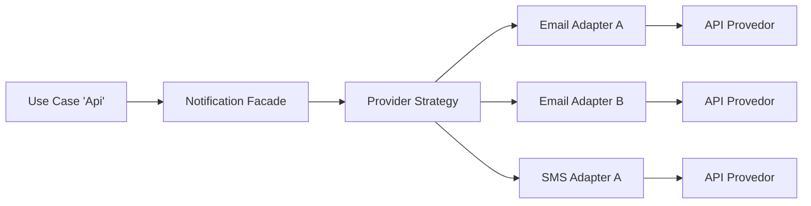

# Questão 7 — Design Patterns para normalizar provedores terceiros (E-mail/SMS)

## Resposta curta
Os padrões principais são **Adapter + Strategy**, apoiados por **Facade**, **Factory**, **Circuit Breaker** e **Retry com backoff**.

## 1) Padrões recomendados e motivos
- **Adapter**: como cada provedor funciona e é adaptado para um contrato interno único.
- **Strategy**: seleciona dinamicamente qual provedor usar (prioridade, custo, latência, health).
- **Facade**: expõe uma API simples para o domínio (`NotificationService.send()`), escondendo complexidade.
- **Factory Method / Abstract Factory**: cria adapters por configuração/feature flag sem if-else espalhado.
- **Anti-Corruption Layer (ACL)**: o adapter ficaria responsável por entender o erro e traduzir para o domínio.
- **Circuit Breaker**: protege o sistema de provedores degradados detectando falhas e demoras fechando o circuito de envio.
- **Retry com backoff + jitter**: recupera falhas transitórias sem gerar tempestade de chamadas, utilizando retentativas 
exponenciais e aleatoriedade nestes tempos. 
- **Modo assíncrono com fila**: para campanhas de alto volume, desacoplando o envio do fluxo principal.

## 2) Arquitetura sugerida
Camadas:
1. **Application/Use Case**: decide quando notificar.
2. **Porta de domínio** (`NotificationProvider`): contrato único.
3. **Adapters de infraestrutura**: implementação por provedor.
4. **Resiliência**: timeout, retry, circuit breaker, fallback.
5. **Observabilidade**: métricas, logs estruturados e tracing.
6. **Modo assíncrono**: com fila para campanhas de alto volume.

## 3) Seleção dinâmica de provedor
Critérios recomendados:
- SLA recente (erro/latência P95/P99)
- custo por mensagem
- disponibilidade por região
- capacidade/quota restante
- prioridade de negócio

Entretanto, implementaria um fallback de seleção por variável de ambiente.

Implementação exemplo: `WeightedStrategy` com ajuste por health em tempo real.

## 4) Falhas, timeout e fallback
- Timeout curto por chamada.
- Retry apenas para erros transitórios (5xx/timeout).
- Circuit breaker por provedor.
- Fallback para provedor secundário quando primário falha.
- Idempotência para evitar envio duplicado em retentativas.

## 5) Benefícios e trade-offs
Benefícios:
- baixo acoplamento e troca de provedor com baixo impacto.
- melhoria de resiliência e observabilidade.
- evolução incremental (novos provedores sem mexer no domínio).

Entretanto, há complicações como:
- Complexidade inicial;
- Necessidade de monitoramento e alertas;
- Esforço em garantias de cada provedor.
